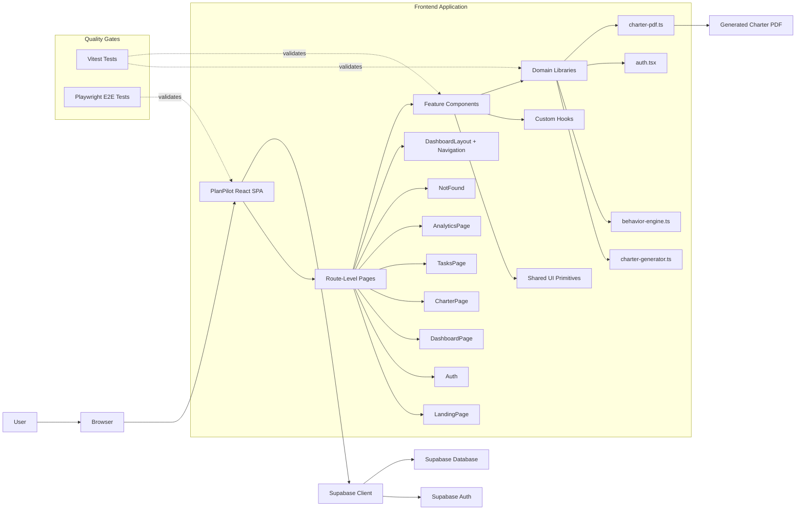

# PlanPilot

PlanPilot is a single-page planning and workflow application built with React, Vite, and TypeScript. It is designed around the idea that good work does not start with a task list alone: it starts with clarity, context, priorities, and a shared understanding of what a project is trying to accomplish.

At its core, PlanPilot helps users create and manage project charters, organize work into projects and tasks, review analytics, and receive lightweight guidance around behavior patterns, workload, and burnout risk. The product combines a modern client-side application shell with Supabase-backed authentication and persistence, giving the app a focused frontend architecture while still supporting real user accounts, database-backed workflows, and typed data access.

This repository contains the browser application, reusable UI system, domain logic, Supabase integration, database migrations, and automated test setup needed to develop and validate the product.

---

## Table of Contents

- [Product Overview](#product-overview)
- [What This Repository Contains](#what-this-repository-contains)
- [Architecture at a Glance](#architecture-at-a-glance)
- [Technology Stack](#technology-stack)
- [Application Structure](#application-structure)
- [Routing Model](#routing-model)
- [Authenticated App Shell](#authenticated-app-shell)
- [Core Product Workflow](#core-product-workflow)
- [Domain Logic](#domain-logic)
- [Supabase Integration](#supabase-integration)
- [Authentication](#authentication)
- [UI System](#ui-system)
- [PDF and Export Flow](#pdf-and-export-flow)
- [Testing Strategy](#testing-strategy)
- [Static Assets and Entrypoints](#static-assets-and-entrypoints)
- [Getting Started](#getting-started)
- [Environment Variables](#environment-variables)
- [Common Commands](#common-commands)
- [Development Notes](#development-notes)
- [Suggested Future Improvements](#suggested-future-improvements)

---

## Product Overview

PlanPilot appears to be a planning assistant for people and teams who need a more structured way to move from vague project ideas into actionable work.

Instead of treating planning as only a list of tasks, the application emphasizes charters. A charter is a structured project document that captures the purpose, goals, scope, responsibilities, expectations, and operating context of a project. This makes the product useful for early-stage planning, project alignment, personal productivity, and workflow review.

The product also includes operational views such as tasks and analytics, which suggests that PlanPilot is intended to support the full lifecycle of a project:

1. A user enters the application.
2. They authenticate or onboard.
3. They create or review a charter.
4. They manage projects and tasks.
5. They inspect analytics or guidance.
6. They export or share project planning artifacts.

The result is a product that blends planning, execution, and reflective decision support into a single browser-based workspace.

---

## What This Repository Contains

This repository is primarily a frontend application. It does not appear to include a custom backend server such as an Express, Fastify, NestJS, Django, or Rails API. Instead, the app delegates backend concerns to Supabase.

The major areas of the repository are:

- A Vite-powered React application.
- TypeScript source code for pages, components, hooks, and domain libraries.
- Route-level UI screens under `src/pages`.
- Shared components under `src/components`.
- A shadcn/ui-style component layer under `src/components/ui`.
- Supabase client and generated schema types under `src/integrations/supabase`.
- Database migrations under `supabase/migrations`.
- Application-level domain logic under `src/lib`.
- Unit or component testing setup through Vitest.
- Browser/end-to-end testing setup through Playwright.
- Static browser assets in `public`.

In short: this is a client-first application with a real backend-as-a-service integration rather than a purely static prototype.

---

## Architecture at a Glance

The high-level architecture can be understood as a browser SPA with three major internal layers:

1. Route-level pages that define major product surfaces.
2. Reusable components and UI primitives that build the interface.
3. Domain and integration libraries that handle business logic, authentication, persistence, and exports.

Supabase sits outside the browser app as the external backend for authentication and database persistence.



This diagram separates runtime behavior from test tooling. Vitest and Playwright are important to the repository, but they are not part of the production runtime path.

---

## Technology Stack

PlanPilot uses a modern TypeScript frontend stack:

| Area | Technology |
| --- | --- |
| Frontend framework | React |
| Build tool | Vite |
| Language | TypeScript |
| Styling | Tailwind CSS |
| UI primitives | shadcn/ui-style component structure |
| Backend integration | Supabase |
| Auth | Supabase Auth |
| Database | Supabase/Postgres through generated types and migrations |
| Unit/component testing | Vitest |
| Browser/E2E testing | Playwright |
| Static assets | `public` directory and Vite browser entrypoint |

The stack is optimized for fast local development, strong type safety, reusable UI primitives, and browser-based product iteration.

---

## Application Structure

A simplified view of the repository looks like this:

```text
.
├── index.html
├── package.json
├── vite.config.ts
├── tailwind.config.ts
├── postcss.config.js
├── playwright.config.ts
├── playwright-fixture.ts
├── public/
│   └── robots.txt
├── src/
│   ├── main.tsx
│   ├── index.css
│   ├── pages/
│   │   ├── Index.tsx
│   │   ├── LandingPage.tsx
│   │   ├── Auth.tsx
│   │   ├── DashboardPage.tsx
│   │   ├── CharterPage.tsx
│   │   ├── TasksPage.tsx
│   │   ├── AnalyticsPage.tsx
│   │   └── NotFound.tsx
│   ├── components/
│   │   ├── DashboardLayout.tsx
│   │   ├── NavLink.tsx
│   │   ├── CharterWizard.tsx
│   │   ├── CharterReview.tsx
│   │   ├── CharterDisplay.tsx
│   │   ├── ProjectDialog.tsx
│   │   ├── TagInput.tsx
│   │   ├── SuggestionChips.tsx
│   │   ├── BurnoutIndicator.tsx
│   │   └── ui/
│   ├── hooks/
│   │   ├── use-toast.ts
│   │   └── use-mobile.tsx
│   ├── integrations/
│   │   └── supabase/
│   │       ├── client.ts
│   │       └── types.ts
│   ├── lib/
│   │   ├── auth.tsx
│   │   ├── behavior-engine.ts
│   │   ├── charter-generator.ts
│   │   └── charter-pdf.ts
│   └── test/
└── supabase/
    └── migrations/
```

Some filenames may vary slightly over time, but this structure captures the architectural intent of the project: route pages at the top, reusable components below them, shared domain logic in `src/lib`, and external backend configuration through Supabase.

---

## Routing Model

PlanPilot is organized around route-level pages under `src/pages`. These pages form the major user-facing boundaries of the application.

### `LandingPage`

The landing page is the public marketing and entry surface. It likely explains what PlanPilot does, introduces the product value proposition, and directs users toward authentication or onboarding.

This page belongs to the public side of the application. It should avoid assuming an authenticated user session and should remain focused on product explanation, conversion, and entry.

### `Auth`

The authentication page is the user-facing entry point for sign-in, sign-up, or onboarding flows. It works alongside the Supabase client and the auth helper layer in `src/lib/auth.tsx`.

This page is the bridge between public browsing and the authenticated workspace.

### `Index.tsx`

The index page likely handles root-route behavior. In many Vite/React SPAs, this file decides whether to redirect users to the landing page, dashboard, or another default route depending on application state.

A common responsibility for this page is answering the question: "When someone opens the app root, where should they go?"

### `DashboardPage`

The dashboard is the authenticated home of the product. It is likely where users see an overview of active projects, recent charters, task status, and high-level guidance.

This page acts as the main command center after login.

### `CharterPage`

The charter page is one of the most important product surfaces. It probably hosts the charter creation, review, and display flow.

This page coordinates components such as:

- `CharterWizard`
- `CharterReview`
- `CharterDisplay`
- `SuggestionChips`
- `TagInput`
- `ProjectDialog`

The page is not just a form; it is the primary planning workflow.

### `TasksPage`

The tasks page represents the operational layer of PlanPilot. Once a project or charter exists, users need a way to track concrete work. This page likely provides task lists, status indicators, filtering, or project-specific task views.

It turns planning output into execution structure.

### `AnalyticsPage`

The analytics page provides reflective feedback. This may include workload patterns, project progress, completion trends, behavior signals, or burnout-related indicators.

This page helps users understand not just what they are doing, but how their planning and execution patterns are evolving.

### `NotFound`

The not-found page handles unmatched routes. It gives the SPA a graceful fallback when a user navigates to an invalid URL.

---

## Authenticated App Shell

The authenticated part of PlanPilot appears to use a shared layout boundary built from components such as `DashboardLayout` and `NavLink`.

This layout is important because it keeps the product workspace consistent across pages. Instead of every page recreating its own navigation, spacing, sidebar, header, or responsive behavior, the app shell provides a common frame.

The shell likely owns responsibilities such as:

- Main navigation between dashboard, charter, tasks, and analytics.
- Workspace-level page structure.
- Consistent spacing and responsive layout.
- Shared header/sidebar behavior.
- Active route highlighting through `NavLink`.
- The visual boundary between public pages and authenticated product pages.

This is a healthy separation: public pages can optimize for explanation and conversion, while authenticated pages can optimize for productivity and repeated use.

---

## Core Product Workflow

The central workflow in PlanPilot is the charter lifecycle.

A charter is not just a document; it is a planning artifact that can shape the rest of the workspace. The repository suggests the charter workflow is broken into multiple focused components:

### 1. Input Collection

`CharterWizard` likely guides the user through a structured set of questions. This keeps project planning from becoming an empty text box problem.

The wizard may collect information such as:

- Project name
- Project goals
- Scope
- Constraints
- Risks
- Stakeholders
- Timeline
- Success criteria
- User preferences or working style
- Project tags or categories

Supporting components such as `TagInput`, `SuggestionChips`, and `ProjectDialog` make this input flow more guided and less tedious.

### 2. Draft Generation

Once the user provides enough input, `charter-generator.ts` likely transforms raw form values into a structured charter.

This is an important architectural boundary. The app should not bury charter construction logic directly inside React rendering code. Keeping this logic in `src/lib` makes it easier to test, reuse, and refine.

### 3. Review and Confirmation

`CharterReview` likely gives the user a chance to inspect the generated charter before accepting or saving it.

This stage matters because generated planning artifacts should be editable and reviewable. Users need to feel ownership over the output.

### 4. Final Display

`CharterDisplay` likely renders the completed charter in a clean, readable format.

This component may be reused across several contexts:

- Viewing an existing charter.
- Reviewing a generated charter.
- Preparing a charter for export.
- Displaying a charter inside a project dashboard.

### 5. Export

`charter-pdf.ts` suggests that a finalized charter can be rendered into a downloadable PDF.

This makes the workflow useful beyond the app itself. A charter can become a portable planning document for sharing, archiving, or presentation.

---

## Domain Logic

PlanPilot keeps important non-visual logic in `src/lib`. This is a strong architectural choice because it separates behavior from presentation.

### `charter-generator.ts`

This module likely converts user input into a structured charter. It may normalize fields, assemble sections, create summaries, or generate default language based on collected project metadata.

Potential responsibilities include:

- Mapping wizard answers into charter sections.
- Producing consistent output even when some fields are optional.
- Enforcing required planning fields.
- Creating summaries, goals, risks, and scope statements.
- Keeping charter formatting logic out of page components.

### `behavior-engine.ts`

This module appears to provide lightweight decision support. Based on the filename, it may score, classify, or interpret signals related to user behavior, workload, momentum, or project health.

Potential responsibilities include:

- Evaluating task or project patterns.
- Detecting overload or burnout signals.
- Producing recommendations or status labels.
- Feeding UI components such as `BurnoutIndicator`.
- Keeping scoring logic testable outside React.

### `charter-pdf.ts`

This module likely handles document generation. It is the boundary between application data and a downloadable file.

Potential responsibilities include:

- Preparing charter data for PDF layout.
- Rendering text sections into a document structure.
- Triggering browser-side download behavior.
- Keeping export-specific formatting out of page components.

### `auth.tsx`

This module centralizes authentication state or helpers. It likely wraps Supabase session state and exposes auth information to the rest of the app.

Potential responsibilities include:

- Tracking the current user.
- Loading or refreshing the active session.
- Providing auth context to React components.
- Supporting sign-in and sign-out flows.
- Protecting authenticated routes or workspace screens.

---

## Supabase Integration

Supabase is the backend boundary for PlanPilot.

The repository includes:

- `src/integrations/supabase/client.ts`
- `src/integrations/supabase/types.ts`
- `supabase/migrations`

Together, these files indicate that the app uses Supabase for both runtime access and database schema management.

### Client Entry Point

`client.ts` is the main place where the Supabase client is created. Most application code should import from this file rather than creating new Supabase clients in multiple places.

This keeps configuration centralized and makes it easier to update environment variables, client options, or auth behavior later.

### Generated Types

`types.ts` suggests that Supabase schema types are generated and committed into the repository. This is valuable because it gives the frontend safer access to database tables, rows, inserts, updates, and relationships.

With generated types, the app can catch many integration mistakes before runtime.

### Migrations

The `supabase/migrations` directory shows that database schema changes are tracked as migration files.

This is important for collaboration and deployment because the database model is not just hidden in a remote dashboard. It is versioned alongside the application code.

---

## Authentication

Authentication is handled through Supabase and surfaced through app-specific React code.

The key pieces are:

- `Auth.tsx` for the user-facing sign-in or onboarding page.
- `src/lib/auth.tsx` for shared auth state and helpers.
- `src/integrations/supabase/client.ts` for the Supabase client.

This separation creates a clean boundary:

- Supabase handles identity, sessions, and persistence.
- `auth.tsx` translates that backend state into application state.
- UI pages and components consume auth state without needing to know every detail of Supabase internals.

A well-maintained auth boundary makes the app easier to extend with protected routes, user-specific records, workspace ownership, and sign-out behavior.

---

## UI System

PlanPilot uses a reusable component architecture with a UI primitive layer under `src/components/ui`.

This resembles the shadcn/ui pattern, where low-level primitives such as buttons, dialogs, inputs, tabs, tables, forms, and toasts are composed into higher-level product components.

The UI structure likely has three layers:

1. Primitive components in `src/components/ui`.
2. Feature components in `src/components`.
3. Route-level pages in `src/pages`.

This layering is useful because it prevents route pages from becoming too large and keeps styling decisions reusable.

Examples of feature components include:

- `DashboardLayout`
- `NavLink`
- `CharterWizard`
- `CharterReview`
- `CharterDisplay`
- `ProjectDialog`
- `TagInput`
- `SuggestionChips`
- `BurnoutIndicator`

The app also includes custom hooks such as:

- `use-toast.ts`
- `use-mobile.tsx`

These hooks help standardize common behavior such as notifications and responsive UI state.

---

## PDF and Export Flow

`charter-pdf.ts` represents a secondary output path for the application.

Most of the app is interactive and browser-based, but PDF export turns app data into a durable artifact. That matters for a planning product because charters are often shared outside the tool where they were created.

A likely export flow is:

1. The user creates or opens a charter.
2. The app assembles the charter data.
3. The display layer shows the charter in the UI.
4. The export module formats the charter for PDF generation.
5. The browser triggers a download.

This gives PlanPilot a bridge between interactive planning and document-based collaboration.

---

## Testing Strategy

The repository includes evidence of two levels of testing:

1. Unit or component-level tests through Vitest.
2. Browser or end-to-end tests through Playwright.

### Vitest

Vitest is well suited for testing isolated TypeScript logic and React components. In PlanPilot, the best candidates for Vitest coverage are:

- Charter generation logic.
- Behavior engine scoring or classification.
- Utility functions.
- Auth helper behavior where mockable.
- Component rendering for important UI states.

### Playwright

Playwright validates the app as a user experiences it in the browser. It is useful for testing full flows such as:

- Visiting the landing page.
- Navigating to authentication.
- Loading the dashboard.
- Creating a charter.
- Reviewing and displaying a charter.
- Export-related UI flows.
- Routing fallback behavior.

### Why Both Matter

Vitest catches logic regressions quickly. Playwright catches integration and user-flow regressions. Together, they create a more reliable quality gate than either one alone.

---

## Static Assets and Entrypoints

The browser application starts from:

- `index.html`
- `src/main.tsx`
- `src/index.css`

`index.html` is the Vite HTML entrypoint. `src/main.tsx` mounts the React app into the DOM. `src/index.css` provides global styles and Tailwind layers.

The `public` folder contains static assets that are served directly by Vite. At minimum, the repository includes `public/robots.txt`.

---

## Getting Started

These instructions assume a typical Node.js development environment.

### Prerequisites

Install the following before running the project locally:

- Node.js
- npm, pnpm, yarn, or another compatible package manager
- A Supabase project for authentication and database access
- Playwright browser dependencies if running end-to-end tests

### Installation

Clone the repository and install dependencies:

```bash
git clone <repository-url>
cd <repository-folder>
npm install
```

If this project uses a different package manager, replace `npm install` with the appropriate command, such as `pnpm install` or `yarn install`.

### Run the Development Server

```bash
npm run dev
```

The Vite development server will start locally and print the local URL in the terminal.

### Build for Production

```bash
npm run build
```

This creates an optimized production build.

### Preview the Production Build

```bash
npm run preview
```

This serves the production build locally so it can be checked before deployment.

---

## Environment Variables

PlanPilot depends on Supabase, so local development requires Supabase configuration values.

A typical `.env` file for a Vite + Supabase app looks like this:

```bash
VITE_SUPABASE_URL=<your-supabase-project-url>
VITE_SUPABASE_ANON_KEY=<your-supabase-anon-key>
```

The exact variable names should match the values read by `src/integrations/supabase/client.ts`.

Do not commit real secrets to the repository. Public anon keys are commonly used in browser Supabase apps, but sensitive service-role keys should never be exposed to the frontend.

---

## Common Commands

The exact scripts may vary based on `package.json`, but a Vite React TypeScript project commonly supports commands similar to these:

```bash
npm run dev
npm run build
npm run preview
npm run test
npx playwright test
```

Recommended local workflow:

1. Start with `npm install`.
2. Create a local `.env` file with Supabase values.
3. Run `npm run dev` for local development.
4. Run unit tests before committing logic changes.
5. Run Playwright tests before merging major UI or route changes.
6. Build the app before deployment.

---

## Development Notes

### Keep Route Pages Thin

Route pages should coordinate data and layout, but most reusable UI should live in `src/components`, and most business logic should live in `src/lib`.

This makes pages easier to read and makes logic easier to test.

### Keep Supabase Access Centralized

Supabase configuration should remain centralized in `src/integrations/supabase/client.ts`. Application code should avoid creating duplicate clients unless there is a specific reason.

### Treat Generated Types as a Contract

The generated Supabase types in `types.ts` should be kept in sync with migrations. If the database schema changes, regenerate the types so TypeScript continues to reflect the actual backend model.

### Separate Product Logic From Presentation

Files such as `behavior-engine.ts` and `charter-generator.ts` are valuable because they keep domain logic out of React components. This makes the product easier to reason about and easier to evolve.

### Test the Charter Flow Carefully

The charter workflow is central to the product. Changes to the wizard, generator, review screen, display screen, or PDF export path should be tested together because they form one connected user journey.

---

## Suggested Future Improvements

The current architecture already has a clean separation between pages, components, domain logic, and backend integration. Future improvements could include:

- Expanding automated test coverage for the charter generator and behavior engine.
- Adding more explicit route guards for authenticated-only pages.
- Documenting the Supabase schema and major tables.
- Adding seed data or local development fixtures.
- Adding screenshots or GIFs of the main product flows.
- Documenting deployment steps for the chosen hosting provider.
- Adding accessibility checks for dialogs, forms, navigation, and PDF export controls.
- Creating a contributor guide for coding conventions and pull request expectations.

---

## Summary

PlanPilot is a React, Vite, and TypeScript single-page application for structured planning and workflow management. Its main product idea revolves around project charters, supported by task views, analytics, behavior guidance, burnout indicators, and PDF export.

The application is organized around route-level pages, reusable components, shared domain libraries, and a Supabase backend integration. This makes the repo approachable as a frontend-first product while still supporting real authentication, persistent data, typed database access, and schema migrations.

The strongest architectural theme is separation of concerns:

- Pages define product surfaces.
- Components define reusable interface pieces.
- `src/lib` defines planning and behavior logic.
- Supabase handles backend persistence and auth.
- Tests validate both isolated logic and complete browser flows.

That structure gives PlanPilot a solid base for continued product development.
